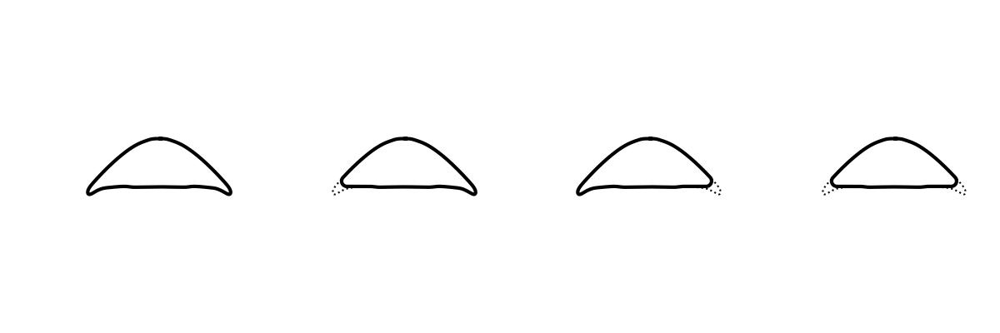
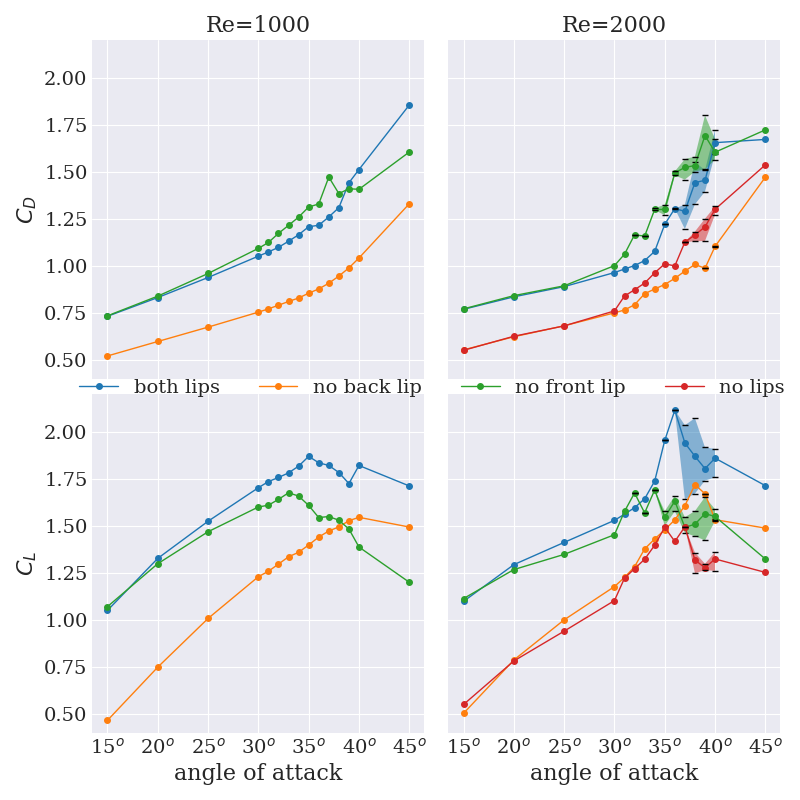
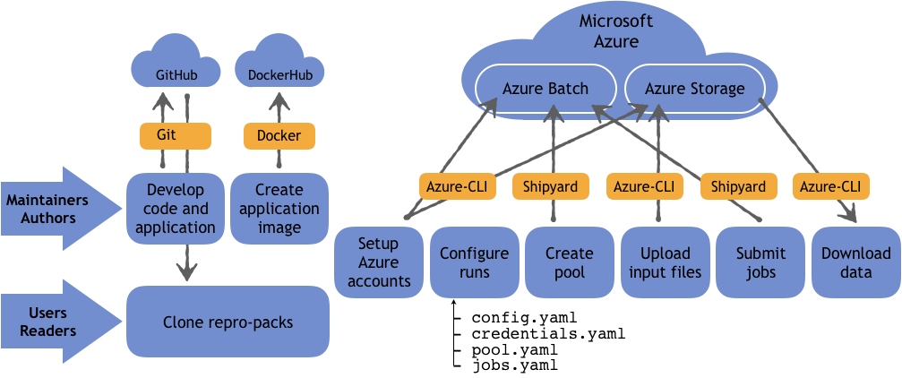

# Numerical study of the effect of the lips on the aerodynamics of the gliding snake

* Olivier Mesnard (The George Washington University)
* Lorena A. Barba (The George Washington University)

We aim to quantify the effect of the lips of the gliding snake cross-section on the aerodynamic performances of the reptile. We will run two- and three-dimensional Computational Fluid Dynamics (CFD) simulations with our in-house research software [PetIBM](https://github.com/barbagroup/PetIBM). We would like to run the cases on Microsoft Azure using a reproducible workflow. Our budget for this numerical study on the cloud is estimated to be around 20,000 USD.

Table of Contents:

- [Numerical study of the effect of the lips on the aerodynamics of the gliding snake](#numerical-study-of-the-effect-of-the-lips-on-the-aerodynamics-of-the-gliding-snake)
  - [Gliding snake](#gliding-snake)
  - [PetIBM](#petibm)
  - [Preliminary results](#preliminary-results)
  - [Running CFD on the cloud](#running-cfd-on-the-cloud)
  - [Cloud requirements](#cloud-requirements)
  - [References](#references)
  - [Copyright and License](#copyright-and-license)

---

## Gliding snake

Arboreal snakes of the species *Chrysopelea paradisi* gained the ability to glide through the air.
The so-called "gliding snake" jumps from tree branches and produces lift by expanding its rib cage (morphing its circular cross-section into a triangular shape).
During the gliding phase, the snake also undulates by sending waves from head to tail.
The S-like body can be viewed a series of straight sections connected connected with curved segments.
The three-dimensional kinematics of the gliding snake is highly complex.
Here, we consider a simplified geometry and focus on one of the straight sections.
The section is modeled as a cylinder with an anatomically accurate cross-section of the gliding snake.

One of the remarkable features of the cross-section is the formation of ventrally oriented lips when expanding the ribs.
The lips run along most of the body, producing a concave ventral surface.
In this study, we aim to quantify the role of the lips on the aerodynamics of the snake model.
Our strategy is to modify the cross-section of the gliding snake by removing one of the lips or both (see figure below) and quantify the relative change in the aerodynamic performances compared to the model with both lips.
The anatomically accurate cross-section of the snake *Chrysopelea paradisi* is available on [figshare](https://doi.org/10.6084/m9.figshare.705877.v1)[1].

**Figure:** Anatomically accurate cross-section of the gliding snake (left) and additional modified geometries investigated. We modify the section by removing one of the lips or both.

## PetIBM

For this numerical study, we will use our in-house CFD software, [PetIBM](https://github.com/barbagroup/PetIBM) (release [0.4.2](https://github.com/barbagroup/PetIBM/tree/v0.4.2)).
PetIBM is an open-source library (BSD-3 clause license) for solving the incompressible Navier-Stokes equations via a projection method[2] and with an immersed boundary method[3].
PetIBM runs on distributed-memory architectures with the possibility to solve linear systems on multiple GPU devices (distributed across the nodes).
PetIBM has been published in the Journal of Open Source Software[4].

## Preliminary results

[Preliminary results](http://nbviewer.jupyter.org/urls/dl.dropbox.com/s/mzotxso2hh5gago/prewriting-executed.ipynb?flush_cache=true) (obtained with two-dimensional simulations) of the flow around the modified bluff-bodies revealed similarities with aircraft wings.
We used [PetIBM-0.2](https://github.com/barbagroup/PetIBM/tree/v0.2) to run these simulations and the figure below reports the time-averaged force coefficients obtained for the different geometries at Reynolds number 1000 and 2000 (based on the chord length and the freestream speed).
At Reynolds number 2000, the maximum lift coefficient for the model with both lips is 23% higher than the maximum value for the section missing the back
This suggests that the back lip plays a similar role than the flap on an aircraft wing: it provides extra lift force.
Also, stall occurs at lower angle of attack when the front lip is removed, for both Reynolds numbers.
The front lip appears to delay stall of the bluff-body, just like a slat on an aircraft wing.

**Figure:** Time-averaged drag (top) and lift (bottom) coefficients versus the angle of attack for all modified cross-sections at Reynolds numbers 1000 (left) and 2000 (right).

## Running CFD on the cloud

We want to conduct the numerical study on the public cloud platform Microsoft Azure.
We have already used the platform in the past to run container-based CFD simulations in a reproducible way (see figure below).
Our workflow[5] uses the Microsoft service called Azure Batch that relieves the user from manually creating, configuring, and managing an HPC-capable cluster of cloud nodes.
We also use the open-source command-line utility Batch Shipyard, entirely driven by configuration files.
Batch shipyard parses user-written YAML files to automatically create pools of compute nodes and submit containerized jobs to those pools.

**Figure:** Reproducible workflow on the public cloud provider Microsoft Azure. The software is version-controlled with Git and GitHub. We push to DockerHub a Docker image of our CFD application with all its dependencies. Azure CLI is use to configure accounts on Microsoft Azure and to upload/download data to/from an Azure Storage account.

## Cloud requirements

The preliminary two-dimensional simulations ran on our university-managed HPC cluster ([Colonial One](https://colonialone.gwu.edu/colonial-one/)), each one on a single node using 12 CPU cores and 2 K20 GPU devices.
On average, a simulation computed 80 time units (200k time steps) in about 15 hours on a computational grid with 2.9 million cells.

We want to re-run the preliminary simulations on the cloud with the newest release of PetIBM.
We will run jobs for each of the four cross-sectional shapes (both lips, no front lip, no back lip, and no lips) at Reynolds number 2000, varying the angle of attack of the section with the freestream between -10 and 50 degrees (5-degree increments).
We will use the same computational grid and compute 250k time steps (100 time units) per simulation.
Each job, submitted with Batch Shipyard, will run on a NC12 virtual machine (12 CPU cores and 2 GPU devices) for a cost of 1.80 USD per hour (price as of [July 25, 2019](https://azure.microsoft.com/en-us/pricing/details/virtual-machines/linux/)).
We estimate we will need 1,400 USD to run all the two-dimensional simulations.

The model configurations that lead to the most interesting features in terms of aerodynamic performances will be used for more expensive three-dimensional simulations.
The snake model in a three-dimensional configuration is a straight cylinder with the same cross-sectional shape than for the two-dimensional case.
The computational grid for the 3D case contains about 46 million cells and will require a job to run on 2 NC24r instances and we will compute 200 time units of flow simulation for each case.
A NC24r has 24 CPU cores and 4 GPU devices, is RMDA-capable for fast networking, and costs 3.96 USD per compute hour (price as of [July 25, 2019](https://azure.microsoft.com/en-us/pricing/details/virtual-machines/linux/)).

Previous three-dimensional simulations on Azure with the same mesh computed 200 time units in about 280 hours.
We plan to submit two jobs for each snake models (8 cases total).
We estimate we will need 17,800 USD to run the three-dimensional simulations.

Our budget for this numerical study is estimated to be around 20,000 USD.

---

## References

[1] Krishnan, Anush; J. Socha, John; P. Vlachos, Pavlos; Barba, Lorena A. (2013). "Body cross-section of the flying snake Chrysopelea paradisi." [figshare](https://doi.org/10.6084/m9.figshare.705877.v1).

[2] Perot, J. B. (1993). An analysis of the fractional step method. Journal of Computational Physics, 108(1), 51-58.

[3] Li, R. Y., Xie, C. M., Huang, W. X., & Xu, C. X. (2016). An efficient immersed boundary projection method for flow over complex/moving boundaries. Computers & Fluids, 140, 122-135.

[4] Pi-Yueh Chuang, Olivier Mesnard, Anush Krishnan, Lorena A. Barba (2018). PetIBM: toolbox and applications of the immersed-boundary method on distributed-memory architectures. Journal of Open Source Software, 3(25), 558, doi:[10.21105/joss.00558](https://doi.org/10.21105/joss.00558).

[5] Mesnard, O., & Barba, L. A. (2019). Reproducible Workflow on a Public Cloud for Computational Fluid Dynamics. arXiv preprint arXiv:1904.07981.

---

## Copyright and License

(c) 2019 Olivier Mesnard, Lorena Barba.
All content is under Creative Commons Attribution [CC-BY 4.0](https://creativecommons.org/licenses/by/4.0/legalcode.txt), and all code is under [BSD-3 clause](https://github.com/barbagroup/snake-lips/blob/master/LICENSE).
